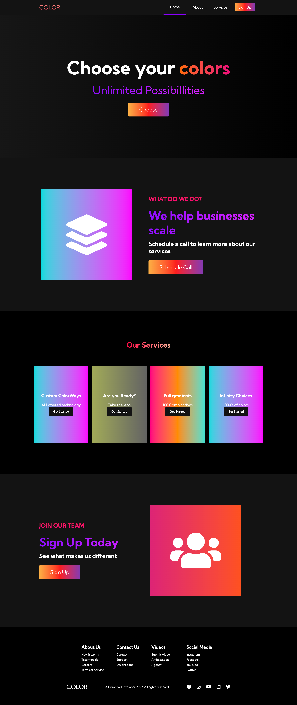

<h1>Colors WebPage</h1>

<h2>Pages:</h2>

<h2 align="center">Desktop Version:</h2>
<p align="center"></p>


<hr>

<h2 align="center">Mobile Version:</h2>

<p align="center">
<br/>

&nbsp;

</p>


<h2>Usage: </h2>

```bash

git clone https://github.com/universal-developer/Colors-WebPage

cd Colors Webpage
```

<h2>And then just put index.html file in your browser ;)</h2>

<hr>

<h2>Link on video:</h2>

<a href="https://youtu.be/3-2Pj5hxwrw"><p align="center">PRESS HERE TO WATCH</p></a>

